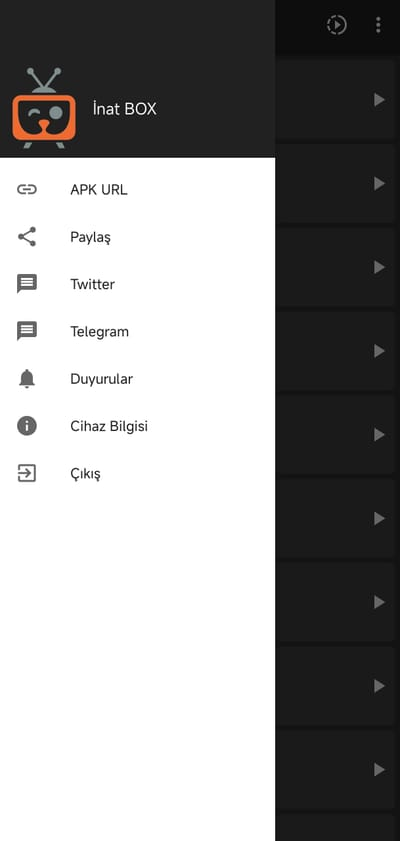

# İnat TV Rehberi: Güncel Adres, İnat BOX v16 İndirme ve Dosya Doğrulama

İnat TV adını kullanarak arama yapan kullanıcılar farklı alan adları, eski sürümler ve birbirinden farklı APK dosyalarıyla karşılaşabilir. Bu depo, güncel resmî adresleri tek yerde göstermek ve hâlen dağıtılan **İnat BOX v16** Android paketine doğrulanabilir bir indirme bağlantısı sağlamak amacıyla düzenlenmiştir.

Bu sayfadaki güncel Android dosyasının uygulama adı İnat BOX, sürüm adı 16.0’dır. Dosya “İnat TV PRO v21” değildir ve kaldırılmış eski sürümlere bağlantı verilmez.

## Güncel İnat TV ve İnat BOX bağlantıları

- Resmî web sitesi: [inatvapp.com](https://inatvapp.com/)
- GitHub hesabı: [github.com/inattv-ops](https://github.com/inattv-ops)
- X hesabı: [x.com/inattvapk](https://x.com/inattvapk)
- İletişim: **inattvapk@gmail.com**

## İnat BOX v16 APK indir

### [Güncel İnat BOX v16 APK dosyasını indir](https://github.com/inattv-ops/inattv/releases/download/v16.0/inat-box-v16.apk)

Bağlantı, bu deponun `main` dalında bulunan `inat-box-v16.apk` dosyasını indirir. Başka bir indirme sitesi veya yönlendirme servisi kullanılmaz.

## İndirilen dosyayı tanıyın

İnternette aynı veya benzer adla paylaşılan APK’ların gerçekten aynı dosya olup olmadığı yalnızca dosya adına bakılarak anlaşılamaz. Sürüm, paket kimliği, boyut ve SHA-256 değerini birlikte kontrol etmek daha sağlıklı bir karşılaştırma sağlar.

| Kontrol alanı | Doğrulanmış değer |
|---|---|
| Uygulama adı | İnat BOX |
| Sürüm | 16.0 |
| Sürüm kodu | 16 |
| Android paket kimliği | `com.bp.box` |
| APK dosyası | `inat-box-v16.apk` |
| Boyut | 22.464.949 bayt (yaklaşık 21,42 MiB) |
| En düşük Android seviyesi | Android 6.0 / API 23 |
| Yerel işlemci mimarileri | `arm64-v8a`, `armeabi-v7a`, `x86`, `x86_64` |
| SHA-256 | `B59D3E0925B498DF32EAE9288216BF6EFC2EB0C4A3A2CB63CAAC9211015A346E` |
| İmza sertifikası SHA-256 | `7CC771973665660F0653FCE2E9490E48B92BE8432A88D74F91703A716F6B4692` |

## İnat TV adı ile İnat BOX arasındaki ilişki

“İnat TV”, kullanıcıların marka ve uygulama ailesini bulmak için kullandığı genel adlardan biridir. Bu depoda dağıtılan güncel Android paketinin kendi uygulama etiketi ise **İnat BOX** olarak tanımlıdır. Bu ayrım önemlidir: arama terimi veya repo adı, APK’nın gerçek uygulama adını ve sürümünü değiştirmez.

Güncel paket hakkında bilgi verirken dosyanın içindeki doğrulanabilir sürüm verilerini esas alıyoruz. Bu nedenle dosyayı “İnat TV v16” veya “İnat TV PRO v16” şeklinde yeniden adlandırmak yerine derleme çıktısındaki gerçek adı olan `inat-box-v16.apk` kullanılır.

## Uygulama ekranları

Aşağıdaki görüntüler İnat BOX v16.0 uygulamasından alınmıştır. Yalnızca bu sayfaya sığması için ölçeklendirilmiştir; kırpılmamış ve içerikleri değiştirilmemiştir.

| Ana ekran | Sol menü | Dikey oynatıcı | TV listesi |
| :---: | :---: | :---: | :---: |
|  |  |  |  |

## İnat TV indirirken neden resmî adres kontrolü yapılmalı?

APK dosyaları uygulama mağazası dışında doğrudan paylaşılabildiği için aynı isimle hazırlanmış farklı paketlere rastlamak mümkündür. Bir sayfanın logosu veya başlığı tek başına dosyanın kaynağını kanıtlamaz. Kontrollü bir indirme için şu adımları izleyin:

1. Bağlantının `github.com/inattv-ops/` altında olduğunu kontrol edin.
2. İnen dosyanın adının `inat-box-v16.apk` olduğundan emin olun.
3. Dosya boyutunu kontrol edin; eksik indirme daha küçük bir dosya oluşturabilir.
4. SHA-256 değerini bu sayfadaki değerle karşılaştırın.
5. Android’in kurulum ekranında gösterdiği uygulama bilgilerini inceleyin.
6. Şüpheli izin veya farklı bir paket adı görürseniz kurulumu iptal edin.

## SHA-256 ile APK doğrulama

### Windows PowerShell

```powershell
Get-FileHash .\inat-box-v16.apk -Algorithm SHA256
```

### Linux

```bash
sha256sum inat-box-v16.apk
```

### macOS

```bash
shasum -a 256 inat-box-v16.apk
```

Beklenen sonuç:

```text
B59D3E0925B498DF32EAE9288216BF6EFC2EB0C4A3A2CB63CAAC9211015A346E
```

Hash eşleşmesi, indirdiğiniz dosyanın yayımlanan kopyayla aynı olduğunu gösterir. Bu kontrol tek başına APK’nın güvenliği, içeriklerin niteliği veya cihazınızdaki çalışma sonucu hakkında garanti oluşturmaz.

Paket ayrıca Android SDK `apksigner` aracıyla kontrol edilmiştir. JAR imzası (v1) ve APK Signature Scheme v2 doğrulaması başarılıdır; APK tek imzalayıcı içerir. Sertifika SHA-256 parmak izi dosya bilgi tablosunda verilmiştir.

## İnat BOX v16 hangi cihazlar için hazırlanmıştır?

Uygulamanın kaynak yapılandırmasında Android telefonlar için standart başlatıcı ve Android TV için Leanback başlatıcısı bulunur. Dokunmatik ekran zorunlu bir donanım özelliği değildir. Bu yapılandırma telefon, tablet, Android TV ve Android tabanlı TV kutularını kapsayabilecek şekilde hazırlanmıştır.

APK’nın kurulabilmesi için cihazın en az Android 6.0 çalıştırması gerekir. Üreticinin güvenlik politikası, işlemci mimarisi, boş alan, sistem güncellemeleri ve önceden kurulmuş farklı imzalı paketler sonucu etkileyebilir. Bu nedenle “Android 6 veya üzerindeki her cihazda kesin çalışır” şeklinde bir garanti verilmez.

Android tabanlı olmayan Smart TV sistemlerinde APK kurulumu desteklenmez. Bir televizyonun “akıllı” olması onun Android TV kullandığı anlamına gelmez; cihaz ayarlarından işletim sistemi bilgisi kontrol edilmelidir.

## Android üzerinde APK kurulum adımları

1. Bu sayfadaki indirme bağlantısından APK’yı indirin.
2. İndirme bildirimine veya dosya yöneticisindeki `inat-box-v16.apk` dosyasına dokunun.
3. Sistem isterse yalnızca kullandığınız tarayıcıya ya da dosya yöneticisine “bu kaynaktan uygulama yükleme” izni verin.
4. Kurulum ekranındaki uygulama adını inceleyin ve işlemi tamamlayın.
5. Kurulumdan sonra geçici olarak verdiğiniz APK yükleme iznini kapatın.

Android ayarlarının isimleri marka ve sürüme göre farklılık gösterebilir. Güvenlik özelliklerini bütünüyle devre dışı bırakmak yerine uygulama bazlı ve geçici izin kullanın.

## Güncelleme yapmadan önce bilinmesi gerekenler

Android, aynı paket kimliğine sahip uygulamaları çoğunlukla mevcut kurulumun üzerine günceller. Ancak paket farklı bir sertifikayla imzalanmışsa veya cihazda başka kaynaktan edinilmiş uyumsuz bir sürüm varsa sistem kurulumu reddedebilir.

- Güncellemeden önce önemli yerel ayarlarınız varsa bunları not edin.
- Eski uygulamayı kaldırmanın uygulama verilerini silebileceğini unutmayın.
- Kurulum hatasında önce boş alanı, Android sürümünü, dosya boyutunu ve hash değerini kontrol edin.
- Kaynağı bilinmeyen “düzenlenmiş”, “mod” veya yeniden paketlenmiş APK’ları güncelleme amacıyla kullanmayın.

## İzinler, bildirimler, analiz ve reklam bileşenleri

İnat BOX v16’nın birleşik APK manifestinde internet, ağ ve Wi-Fi durumu, cihaz açılışı, uyanık tutma, ön plan hizmeti, bildirim, titreşim, Firebase mesaj alımı ve paket kurulum isteği bildirimleri yer alır. Reklam kitaplıkları ayrıca reklam kimliği, Privacy Sandbox reklam hizmetleri ve Install Referrer bağlantısıyla ilgili bildirimler ekler. Uygulamaya özel dinamik alıcı koruması da paket kapsamında tanımlıdır.

Manifestte yer alan her bildirim kullanıcıdan aynı şekilde izin istemez; bazıları sistem veya kitaplık düzeyinde kullanılır. İşletim sistemi, kullanıcı tarafından yönetilebilen izinlerin bir bölümünü ayrıca sorabilir.

Kaynak yapılandırmada Firebase Analytics ve Crashlytics analiz/hata raporlama için, Firebase Cloud Messaging bildirimler için, Unity Ads ve Start.io ise reklam işlevleri için yer alır. Bu teknik gerçekler nedeniyle eski metinlerde bulunan “reklam içermez” veya “hiç veri toplamaz” gibi kesin iddialar güncel rehberde kullanılmaz.

Kullanıcılar Android ayarları üzerinden bildirim izinlerini yönetebilir, uygulama verilerini temizleyebilir ve uygulamayı kaldırabilir. Üçüncü taraf hizmetlerin veri işlemesi kendi şart ve politikalarına da tabi olabilir.

## İnat TV hakkında sık sorulan sorular

### İnat TV’nin yeni sitesi hangisi?

Bu projede kullanılan güncel web adresi [https://inatvapp.com/](https://inatvapp.com/) olarak belirlenmiştir. Eski `inattv.rest` bağlantıları bu depodan kaldırılmıştır.

### Bu depoda İnat TV PRO v21 var mı?

Hayır. Eski `inat-tv-pro-v21.apk` dosyası kaldırılmıştır. Bu sayfanın sunduğu güncel dosya İnat BOX 16.0 paketidir.

### İnat TV veya İnat BOX virüssüz mü?

Bir dosya için inceleme yapılmadan “%100 güvenli” veya “virüssüz” garantisi vermek doğru değildir. Burada yayımlanan SHA-256, dosyanın bütünlüğünü doğrulamak içindir. İndirme kaynağını kontrol edin ve Android’in güvenlik uyarılarını dikkate alın.

### APK neden uygulama mağazası yerine doğrudan indiriliyor?

Bu repo doğrudan APK dağıtımı yapmaktadır. Buradaki bilgiler herhangi bir uygulama mağazasında yayın veya onay bulunduğu anlamına gelmez.

### iPhone için İnat TV IPA dosyası var mı?

Bu depoda yalnızca Android APK dosyası vardır. APK, iPhone veya iPad’e kurulamaz.

### Kurulumda “paket geçersiz” hatası alıyorum; ne yapmalıyım?

İndirmenin tamamlandığını, cihazın Android 6.0 veya üzerini kullandığını ve SHA-256 değerinin eşleştiğini kontrol edin. Aynı paket kimliğine sahip farklı imzalı bir sürüm de kurulumun reddedilmesine neden olabilir.

## Güvenilir bilgi politikamız

Bu README yalnızca repo ve kaynak proje üzerinden doğrulanabilen sürüm, paket, uyumluluk ve yapılandırma bilgilerini içerir. Kesin kanal sayısı, belirli yayınların sürekli kullanılabilirliği, “donmadan çalışma”, “her cihazla uyumluluk” veya mutlak güvenlik gibi doğrulanamayan pazarlama iddiaları kullanılmaz.

Uygulama üzerinden erişilebilen içeriklerin kullanımında yerel mevzuata, hizmet şartlarına ve hak sahiplerinin koşullarına uymak kullanıcının sorumluluğundadır. Bu depo üçüncü taraf marka veya içerikler üzerinde sahiplik iddiasında bulunmaz.

## Kısa bağlantılar

- [İnat BOX v16 indir](https://github.com/inattv-ops/inattv/releases/download/v16.0/inat-box-v16.apk)
- [İnat TV resmî sitesi](https://inatvapp.com/)
- [İnat TV GitHub hesabı](https://github.com/inattv-ops)

---

**Dosya:** `inat-box-v16.apk` · **Sürüm:** 16.0 · **SHA-256:** `B59D3E0925B498DF32EAE9288216BF6EFC2EB0C4A3A2CB63CAAC9211015A346E`
